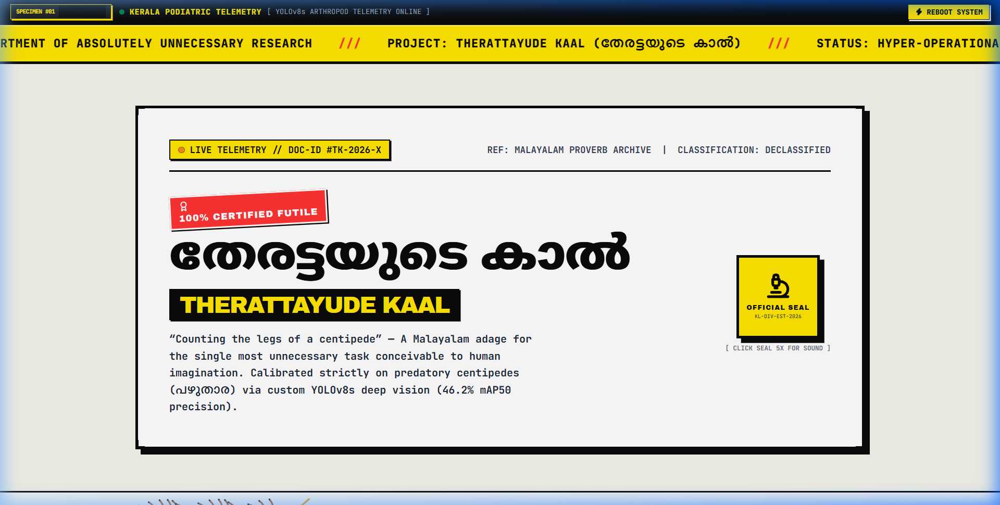
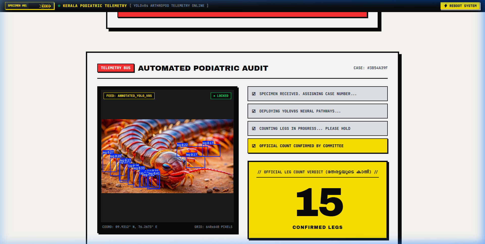
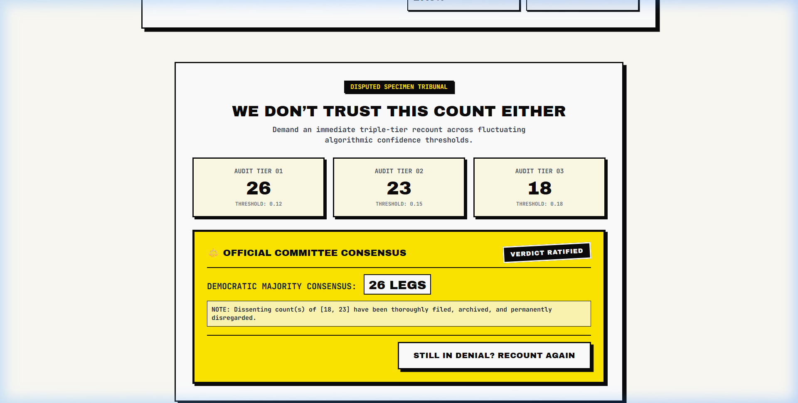
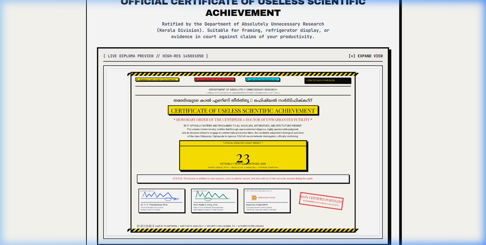
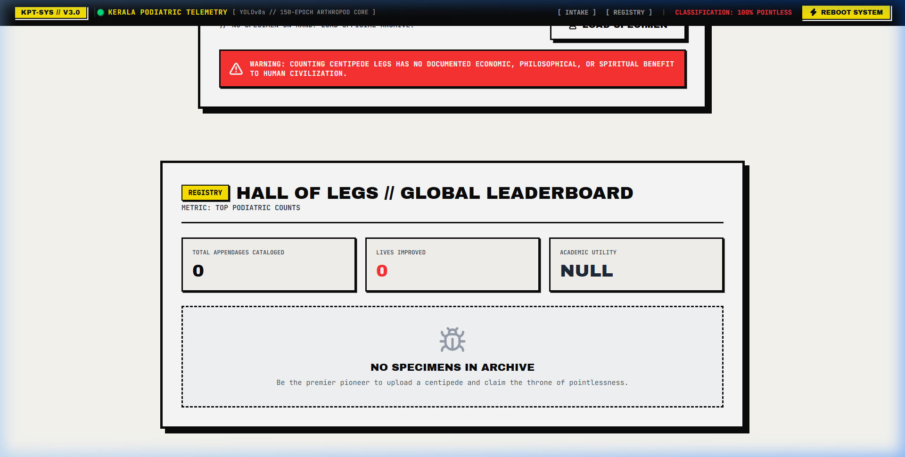
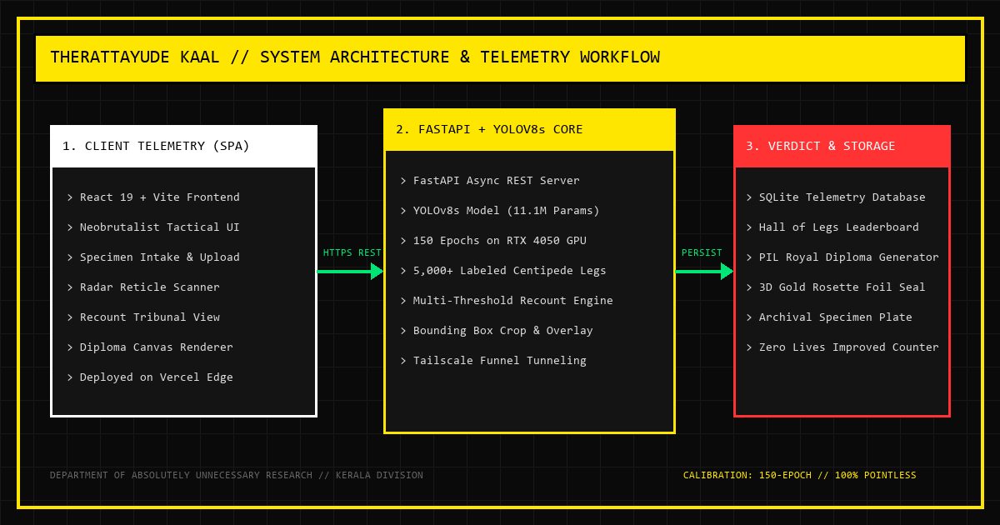

# Therattayude Kaal 🎯

## Basic Details
### Team Name: Mandi Masala

### Team Members
- Team Lead: Alfie Varghese - St. Joseph's College of Engineering and Technology, Palai
- Member 2: S Tippu Sahib - St. Joseph's College of Engineering and Technology, Palai

### Project Description
In Malayalam, when someone wastes time doing something completely pointless, people say "തേരട്ടയുടെ കാൽ എണ്ണുവാണോ?" (Are you counting a centipede's legs?). We took that literally. This web app uses a custom YOLOv8s computer vision model trained on over 5,000 hand-labeled legs to count every individual leg on a centipede (പഴുതാര) and print an official diploma certifying your wasted time.

### The Problem (that doesn't exist)
Centipedes run around at night with somewhere between 15 and 40 visible legs. Nobody in Kerala, or anywhere else on Earth, has ever needed an exact inventory of how many legs were on the centipede under their bed. People just want it out of the room.

### The Solution (that nobody asked for)
Instead of grabbing a broom, you can now take a photo and run it through a full computer vision pipeline:
- Upload any photo of a centipede.
- A custom-trained YOLOv8s model detects every individual leg with bounding boxes and confidence scores.
- If you disagree with the count, the Recount Tribunal runs the model three times at different thresholds (0.10, 0.15, 0.20) so you can argue with the algorithm.
- Once you accept the number, the system prints a high-res Royal Diploma signed by Dr. Kaalu Vettichu and Prof. Mandi Masala.
- The results go straight to the Hall of Legs leaderboard, which proudly tracks total legs counted and zero lives improved.

## Technical Details
### Technologies/Components Used
For Software:
- Languages used: Python 3.11, JavaScript (React 19), CSS3, HTML5
- Frameworks used: FastAPI, Vite, Tailwind CSS
- Libraries used: Ultralytics YOLOv8s, Pillow, SQLite3, Lucide React, Web Audio API
- Tools used: Docker, Docker Compose, Vercel, Tailscale Funnel, Git

For Hardware:
- Main components: None (pure software project)
- Specifications: Calibrated and trained locally on an NVIDIA GeForce RTX 4050 GPU
- Tools required: Web browser and camera / centipede photograph

### Implementation
For Software:
# Installation
1. Clone the repository:
```bash
git clone https://github.com/Alfievarghese/Therattayude_kaal.git
cd Therattayude_kaal
```

2. Set up the backend:
```bash
cd backend
python -m venv venv

# Windows:
venv\Scripts\activate
# Linux/macOS:
source venv/bin/activate

pip install -r requirements.txt
```

3. Set up the frontend:
```bash
cd ../frontend
npm install
```

# Run
### Local Development

1. Start FastAPI backend:
```bash
# Inside backend/ with venv active
uvicorn main:app --reload --host 0.0.0.0 --port 8000
```

2. Start Vite frontend:
```bash
# Inside frontend/
npm run dev
```
Open http://localhost:5173 in your browser.

### Docker Compose (Production)
Run the full stack with one command:
```bash
docker compose up -d --build
```
Access the application on http://localhost (Port 80).

### Project Documentation
For Software:

# Screenshots (Add at least 3)

*Tactical telemetry command cockpit with system classification and warning ticker.*


*YOLOv8s neural scanner isolating and tallying individual centipede legs with bounding boxes.*


*Democratic recount tribunal for users who dispute the initial leg count.*


*Downloadable Royal Diploma of Useless Achievement certifying the audited leg count.*


*Global Hall of Legs leaderboard tracking top specimens and zero lives improved.*

# Diagrams

*System architecture showing the React 19 frontend, FastAPI gateway, YOLOv8s inference engine, and SQLite telemetry database.*

For Hardware:

# Schematic & Circuit
*Not applicable (pure software computer vision project).*

# Build Photos
*Not applicable (pure software computer vision project).*

### Project Demo
# Video
[Demo Video Coming Soon]
*Walkthrough of the centipede leg counting protocol, recount tribunal, and diploma generator.*

# Additional Demos
- Live Web Application: https://therattayudekaal.vercel.app/

## Team Contributions
- Alfie Varghese: Built the React 19 frontend, handled Vercel deployment, configured Docker services, and set up Tailscale funneling.
- S Tippu Sahib: Curated the dataset, labeled over 5,000 centipede legs in AnyLabeling, and trained/evaluated the YOLOv8s model for 150 epochs.

---
Made with ❤️ at TinkerHub Useless Projects 


